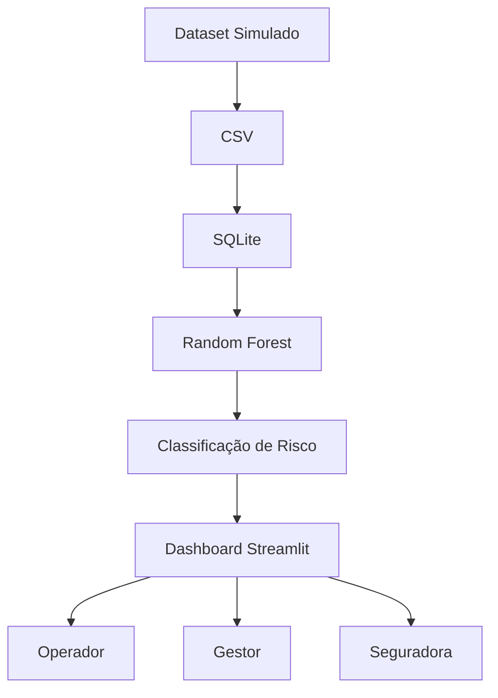

# 🌱 AgroGuardian AI  
### Inteligência preditiva e preventiva para operações agrícolas
### Transformando decisões agrícolas reativas em inteligência preditiva baseada em dados
---
## Sumário

- [ Sprint 1](#sprint-1)
- [ Sprint 2](#sprint-2)

---

#  Sprint 1
##  Descrição do Projeto

O **AgroGuardian AI** é uma solução baseada em dados e Inteligência Artificial que tem como objetivo **identificar, prever e reduzir riscos operacionais e ambientais no uso de equipamentos agrícolas**.

Diferente de abordagens tradicionais reativas, o sistema atua de forma **proativa**, antecipando problemas e auxiliando na tomada de decisão antes que prejuízos ocorram.

---

##  Problema

O uso de equipamentos agrícolas envolve diversos riscos operacionais e ambientais, como:

- Atolamentos  
- Falhas mecânicas  
- Danos causados por condições climáticas  
- Acidentes durante operação  

Grande parte das decisões ainda são tomadas de forma **reativa**, apenas após o problema acontecer, o que gera:

- Altos custos  
- Perda de equipamentos  
- Baixa eficiência operacional

Além disso, situações reais evidenciam o problema: imagine um operador realizando a colheita após um período de chuva intensa, em uma área próxima a um rio. Sem análise prévia, o solo pode estar instável, aumentando significativamente o risco de atolamento, falhas mecânicas e prejuízos financeiros. 

Esse cenário demonstra a necessidade de transformar decisões reativas em decisões preditivas, baseadas em dados.

---

##  Solução Proposta

O AgroGuardian AI propõe um sistema inteligente capaz de:

-  Integrar dados ambientais e operacionais  
-  Utilizar Inteligência Artificial para prever riscos  
-  Gerar alertas preventivos  
-  Simular cenários antes da execução  
-  Exibir um mapa de risco interativo  

---

##  Diferenciais

- Predição + recomendação (não apenas alerta)  
- Simulação de cenários (“e se?”)  
- Score de risco inteligente  
- Visão estratégica para seguradoras  
- Possibilidade de evolução para automação  

---

##  Personas

### Operador de Máquinas
- Necessidade: tomar decisões rápidas e seguras durante a operação  
- Dor: risco de acidentes, falhas e perda de produtividade  
- Solução: alertas em tempo real e recomendações preventivas  

### Gestor Agrícola
- Necessidade: planejamento estratégico e controle operacional  
- Dor: altos custos com falhas e baixa previsibilidade  
- Solução: dashboard com análise de risco e apoio à tomada de decisão  

### Seguradora
- Necessidade: reduzir sinistros e prever riscos dos clientes  
- Dor: dificuldade em antecipar eventos de alto custo  
- Solução: score de risco inteligente e análise preditiva  

---

##  User Stories

- Como operador, quero receber alertas de risco em tempo real para evitar acidentes.  
- Como gestor, quero visualizar dados e mapas de risco para planejar operações.  
- Como seguradora, quero analisar o risco dos clientes para reduzir sinistros.  

---

##  Estrutura de Dados

### Variáveis Ambientais
- Volume de chuva (mm)  
- Tipo de solo  
- Umidade do solo (%)  
- Proximidade de água (m)  

### Variáveis Operacionais
- Tipo de operação  
- Velocidade da máquina  
- Carga transportada  

### Variáveis Comportamentais (Diferencial)
- Histórico do operador  
- Frequência de incidentes  
- Padrão de uso  

---

##  Descrição dos Dados

Os dados utilizados serão simulados e organizados em formato tabular.

Cada variável representa um fator de risco relevante:

- **Chuva**: influencia na umidade e risco de atolamento  
- **Solo**: impacta a estabilidade do terreno  
- **Umidade**: indica saturação do solo  
- **Distância da água**: risco de alagamento  
- **Histórico**: indica recorrência de problemas  

---

##  Exemplo de Dataset

| Chuva | Solo     | Umidade | Distância | Operação   | Histórico | Risco |
|------|----------|--------|----------|------------|----------|-------|
| 80   | Argiloso | 90     | 50       | Colheita   | 3        | Alto  |
| 20   | Arenoso  | 30     | 300      | Transporte | 0        | Baixo |
| 50   | Misto    | 70     | 100      | Plantio    | 1        | Médio |

---

##  Modelo de Inteligência Artificial

###  Objetivo
Classificar o nível de risco operacional

###  Entradas
- Dados ambientais  
- Dados operacionais  
- Dados comportamentais  

###  Saída
- Classificação de risco:
  - Baixo  
  - Médio  
  - Alto  

###  Abordagem
- Modelos de classificação (Decision Tree, Random Forest)

### Justificativa da Abordagem

Os modelos de classificação foram escolhidos por sua eficiência na análise de múltiplas variáveis e capacidade de identificar padrões complexos.

- **Decision Tree**: permite fácil interpretação das decisões, sendo útil para explicar os fatores de risco.
- **Random Forest**: melhora a precisão ao combinar múltiplas árvores, reduzindo overfitting e aumentando a robustez do modelo.

Essa abordagem é ideal para cenários com dados heterogêneos e variáveis ambientais dinâmicas.

---

##  Uso da Inteligência Artificial

A Inteligência Artificial será utilizada para identificar padrões entre variáveis ambientais e operacionais, permitindo prever situações de risco antes que ocorram.

O modelo poderá evoluir com dados reais, tornando-se mais preciso ao longo do tempo.

---

##  Arquitetura da Solução

###  Diagrama (Mermaid)

```mermaid
flowchart LR
A[Sensores / APIs] --> B[Coleta de Dados]
B --> C[Processamento - Pandas]
C --> D[Modelo de IA]
D --> E[Motor de Decisão]
E --> F[API - FastAPI]
F --> G[Dashboard]
G --> H[Usuário]
 ```

## Tecnologias Utilizadas
- Python
- Pandas
- Scikit-learn
- FastAPI
- Streamlit

##  Interface
- Dashboard com mapa de risco
- Alertas em tempo real
- Recomendações automáticas

## Segurança

- Autenticação de usuários (JWT)  
- Controle de acesso por perfil (RBAC)  
- Proteção e criptografia de dados sensíveis  
- Registro de logs para auditoria  
- Garantia de integridade das informações  

##  Valor de Negócio
- Redução de custos com sinistros
- Aumento da eficiência operacional
- Produto escalável para seguradoras

##  Planejamento das Próximas Etapas

O desenvolvimento do **AgroGuardian AI** seguirá uma abordagem incremental, garantindo evolução contínua da solução:

###  Sprint 2 — Estruturação e Expansão dos Dados
- Definição final das variáveis do modelo  
- Criação e validação do dataset simulado  
- Análise exploratória inicial (correlações e padrões)  

###  Sprint 3 — Desenvolvimento do Modelo de IA
- Implementação de modelos de classificação (Decision Tree / Random Forest)  
- Treinamento e validação inicial do modelo  
- Avaliação de desempenho (acurácia e ajuste de parâmetros)  

###  Sprint 4 — Integração e Interface
- Desenvolvimento da API para comunicação com o modelo  
- Criação do dashboard interativo  
- Exibição de risco, alertas e recomendações em tempo real  

###  Sprint 5 — Testes e Validação
- Testes com diferentes cenários simulados  
- Ajustes no modelo e nas regras de decisão  
- Validação da consistência dos resultados  

###  Sprint 6 — Evolução e Escalabilidade
- Integração com dados reais (APIs e sensores)  
- Refinamento do modelo com novos dados
- Expansão das funcionalidades (automação e recomendações avançadas)

## 🎥 Apresentação em Vídeo

Link do vídeo: https://youtu.be/261MIbsOJ_M?si=QonzMxd4Xf-3H_bO

> Projeto desenvolvido individualmente, contemplando todas as etapas da solução, da concepção à arquitetura.
---

#  Sprint 2

Nesta etapa do Challenge Sompo Seguros, o projeto evoluiu da fase conceitual para uma implementação funcional, integrando Engenharia de Dados, Machine Learning e Visualização de Dados.

### Funcionalidades Implementadas

####  Geração de Dados

- Dataset agrícola simulado com mais de 1000 registros
- Variáveis ambientais, operacionais e históricas
- Classificação automática de risco

####  Banco de Dados

- Banco SQLite para persistência dos dados
- Armazenamento histórico das leituras
- Estrutura preparada para auditoria e rastreabilidade

####  Inteligência Artificial

- Modelo Random Forest
- Classificação dos riscos em:
  - Baixo
  - Médio
  - Alto
  - Crítico

####  Validação Estatística

- Accuracy Score
- Matriz de Confusão
- Classification Report
- Importância das Variáveis

####  Dashboard Interativo

- Visualização dos registros
- Distribuição dos níveis de risco
- Simulação de cenários
- Recomendações preventivas

---
#  Estrutura do Projeto

```text
AgroGuardianAI/
│
├── data/
│   └── dataset_sompo.csv
│
├── database/
│   └── agroguardian.db
│
├── dashboard/
│   └── app.py
│
├── src/
│   ├── dataset_generator.py
│   ├── database_setup.py
│   ├── model.py
│   └── menu.py
│
├── requirements.txt
│
└── README.md
```

---
#  Arquitetura da Solução



---
#  Como Executar

Instalar dependências:

```bash
pip install -r requirements.txt
```

Executar menu principal:

```bash
python src/menu.py
```

Executar dashboard:

```bash
streamlit run dashboard/app.py
```

---

# 📸 Evidências da Implementação

## 1. Menu Principal


O menu centraliza todas as funcionalidades do sistema.

---

## 2. Dataset Gerado


Dataset simulado contendo variáveis ambientais, operacionais e históricas.

---

## 3. Banco de Dados SQLite


Persistência dos dados para auditoria e rastreabilidade.

---

## 4. Distribuição dos Riscos


Distribuição dos níveis de risco identificados pelo AgroGuardian AI a partir do dataset simulado. O gráfico permite visualizar a concentração de cenários classificados como Baixo, Médio, Alto e Crítico, auxiliando gestores e seguradoras na análise preventiva dos riscos operacionais.

---

## 5. Treinamento do Modelo


Execução do treinamento do modelo Random Forest utilizando dados armazenados no banco SQLite. O processo inclui análise de correlação, separação dos dados em treino e teste e geração das previsões.

---

## 6. Accuracy do Modelo


O modelo Random Forest alcançou uma acurácia de **96%**, demonstrando alta capacidade de classificação dos níveis de risco operacionais com base nas variáveis ambientais e históricas analisadas.

---

## 7. Matriz de Confusão


A matriz de confusão evidencia que a maior parte das classificações ocorreu corretamente, demonstrando que o modelo é capaz de identificar padrões de risco operacional de forma confiável.

---

## 8. Importância das Variáveis


Identificação dos fatores que mais impactam o risco operacional.

---

## 9. Dashboard e Simulação de Cenários


Visualização dos indicadores e previsão de novos cenários.

---

## 10. Sistema de Recomendações


Além da classificação de risco, o AgroGuardian AI gera recomendações preventivas automáticas para auxiliar operadores, gestores agrícolas e seguradoras na tomada de decisão.

As recomendações são geradas dinamicamente conforme o nível de risco identificado pelo modelo de Inteligência Artificial.

--- 
# 🎥 Apresentação em Vídeo

Link do vídeo:

https://youtu.be/jBynvIRIsOc
